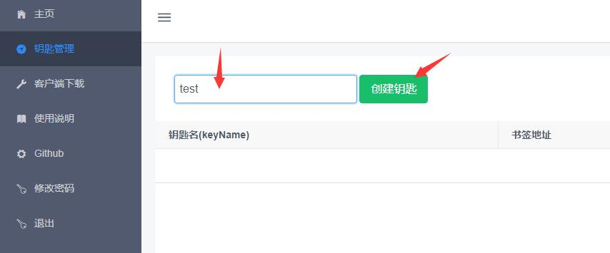
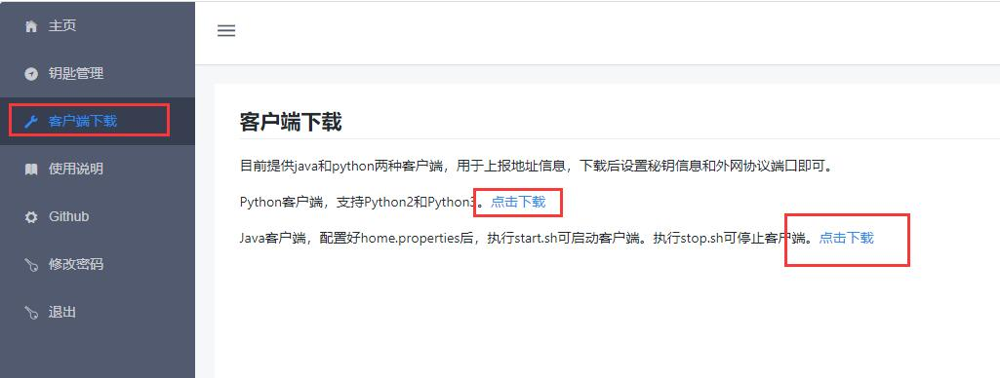
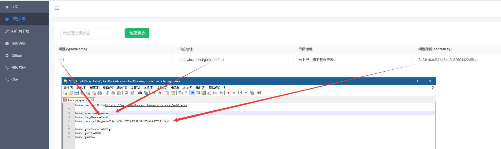

# WayHome 回家之路

  
对浏览器支持的协议，它比DDNS更方便。  
外网访问家中的服务器总是不方便。当我在家搭建了NAS和HomeAssistant后，我觉得我需要自己撸这个轮子了。

## 实现原理  
通过浏览器302重定向，跳转到设定的URL上。  

1. 客户端每隔一段时间向服务器发送更新报文，报文包含了跳转所需的协议、端口、路径参数以及钥匙信息。
2. 服务器根据收到的报文获取跳转所需的参数，同时获取客户端的公网IPv4地址。
3. 当浏览器访问服务器的跳转接口时，根据客户端上报的信息将请求重定向至客户端设定的地址上。  

与DDNS不同在于没有TTL，可实时同步地址，也不需要自己申请域名，对用户成本更低。  
与花生壳、frp、Ngrok相比，跳转后的所有流量不需要服务器参与，用户与自己的服务器直连，延迟更低，更好的用尽上下行带宽。所以，如果你在家搭建了NAS，那么WayHome是一个非常好的选择。

## 使用指南

  WayHome可以让你更低成本、快捷的在外网访问有非固定公网IP的主机。  
  类似与DDNS，但是不需要自己购买域名。  
  不同于向日葵、ngork、frp，所有流量不会走WayHome服务器，可以最大限度使用主机的上行带宽。  
  
  1. 注册一个WayHome账号([注册地址](https://wayhome.zhangtory.com/register))或登录。  
  您的WayHome账号名将作为访问地址的一部分，建议使用方便记忆的用户名。  
  
  2. 在管理后台创建一个钥匙，创建时需要输入钥匙名，点击“创建钥匙”，之后就可以在钥匙列表看到钥匙信息。  
  
  
  3. 下载客户端，现在有java和python两种客户端，基本满足了linux服务器的使用。  
  
  
  4. 根据钥匙信息配置客户端。  
  用户名、钥匙名和秘钥是必填的。  
  协议一般是http，也支持https和ftp等；端口是你自己服务器对外开放的端口，注意80/443/8080已被电信屏蔽；路径可不填。  
  
  
  5. 运行客户端。  
  java可以直接执行start.sh脚本。  
  
  6. 最后在控制台就能看到目标地址，也就是你家的公网IP和你配置的协议及路径。  
  点击GoHome按钮可以直接跳转到目标地址。  
  书签地址是固定的，由你的用户名和钥匙名组成，可以发送给别人或创建书签。  
  
## WayHome程序架构概览

#### 1. 前端way-home-front
使用vue + iView作为网页的前端显示。
主要为用户提供使用说明、后台管理等功能。

#### 2. 管理后台way-home-admin
实现用户注册、登录，用户钥匙创建等功能的接口，供前端调用。

#### 3. 地址核心way-home-core
实现地址获取、地址信息上报功能。
考虑到用户量足够大时，除了对redis进行扩展，还需要对way-home-core进行横向扩展。

## API

* 地址更新上报接口  
  客户端定时上报跳转信息，需要username、keyName、protocol、port、path、timestamp参数，并签名sign。  
  `POST`请求，地址：https://wayhome.zhangtory.com/api/address
   参数以json形式放入body， 使用UTF-8编码，并设置header : 'Content-Type': 'application/json;charset=utf-8'。     
  `username` : 你的用户名。
  `keyName` : 你的钥匙名。  
  `protocol` : 访问协议，如http、https、ftp。  
  `path` : 路径参数，可选，如?user=admin&password=123456。  
  `timestamp` : 毫秒级时间戳。  
  `sign` : 参数名按照ascii升序排序，并以key=value&key=value&secretKey=secret形式拼接成字符串，然后对字符串取MD5摘要，MD5不区分大小写。  

* 地址信息获取接口  
  获取钥匙对应的地址信息，以json形式返回。
  `GET`请求，https://wayhome.zhangtory.com/api/address/{username}/{keyName}
  `username` : 你的用户名。
  `keyName` ： 你的钥匙名。

## 开发中...
  如果你有什么想法，可以提Issue给我们，或者发邮件到i@zhangtory.com 。  
  后续我会根据我自己的使用进行优化。
